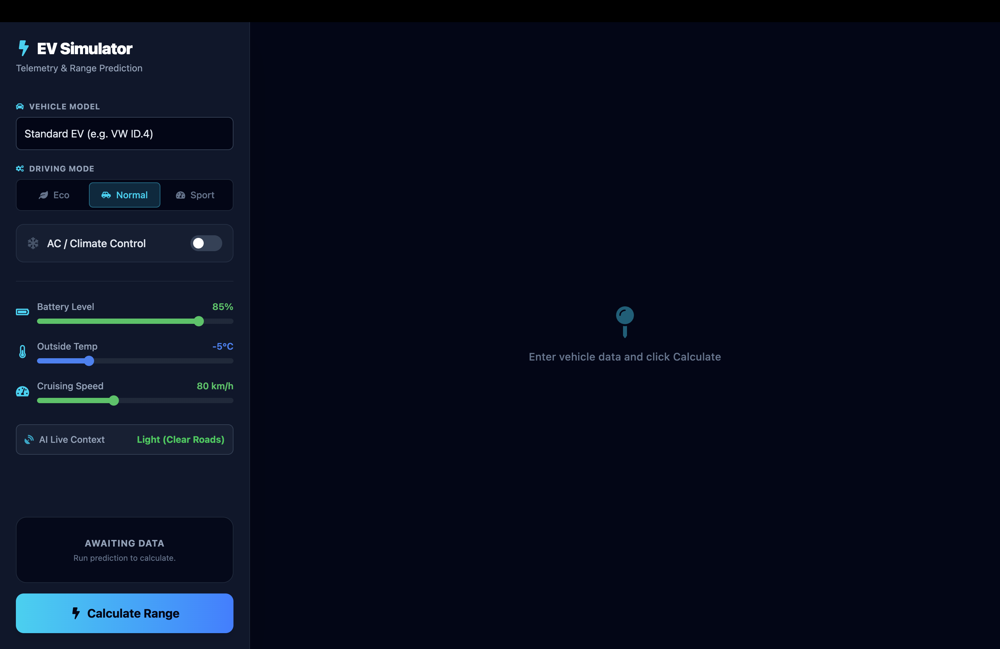
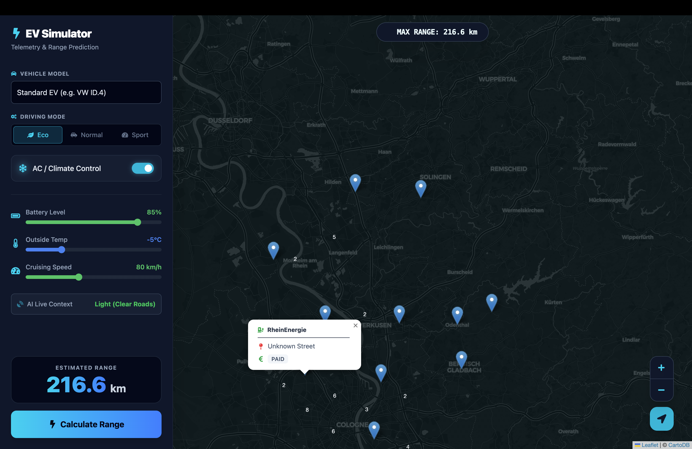
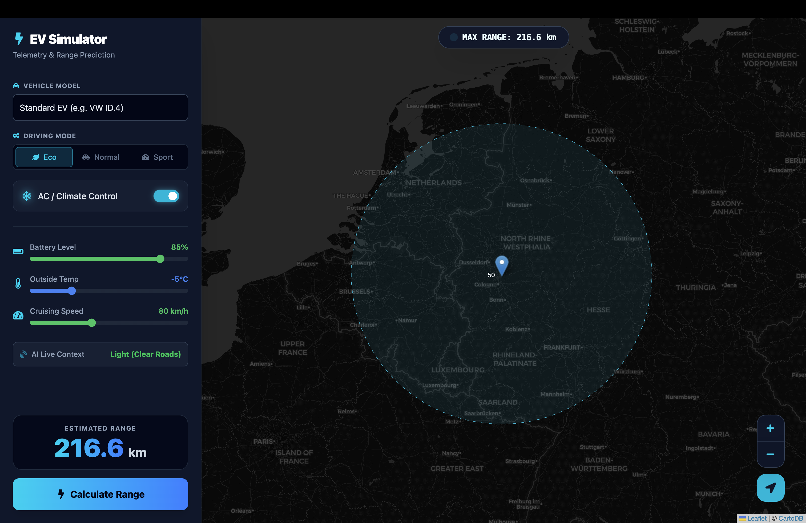

# EV Range Simulator

Predict how far an electric vehicle can travel under different driving and
environmental conditions. A full-stack machine-learning app: enter the conditions,
and a trained regression model estimates the remaining range in real time.

**Live demo:** https://ev-project-jade.vercel.app





---

## What it does

- Takes driving and environmental inputs (e.g. speed, temperature, load,
  battery state)
- Runs them through a trained **XGBoost regression** model
- Returns an estimated driving range instantly through a clean web interface

---

## How it works

```
User inputs (conditions)
        │
        ▼
   React frontend
        │  (HTTP request)
        ▼
   FastAPI backend  ──►  XGBoost model  ──►  Predicted range
        │
        ▼
   Result returned to UI
```

The XGBoost model is trained on feature-engineered data and served through an
**async FastAPI** endpoint. The React frontend collects inputs and displays
predictions in real time.

---

## Tech stack

**ML:** Python · XGBoost · scikit-learn · Pandas · NumPy
**Backend:** FastAPI (async)
**Frontend:** React · Vite
**Deployment:** Docker · Render

---

## Key engineering decisions

- **XGBoost** chosen for tabular regression — strong performance on structured
  feature data without heavy tuning
- **Feature engineering** on driving/environmental variables to improve prediction
  quality
- **Async FastAPI** to keep predictions responsive
- Clean separation between model-serving backend and React frontend

---

## Running locally

```bash
# Backend
cd backend
pip install -r requirements.txt
uvicorn main:app --reload

# Frontend
cd frontend
npm install
npm run dev
```

---

## About

Built as a self-directed project to practise the full ML product cycle — from data
and feature engineering through model training to deploying a served model behind a
real frontend. Developed alongside my M.Sc. in Computer Science (E-Government) at
the University of Koblenz.

> Developed with AI assistance during implementation; I understand and can explain
> every part of the codebase.

**Author:** Aswin Pulickal Binduraj · [LinkedIn](https://linkedin.com/in/aswin-pulickal) · [GitHub](https://github.com/aswin8884)
